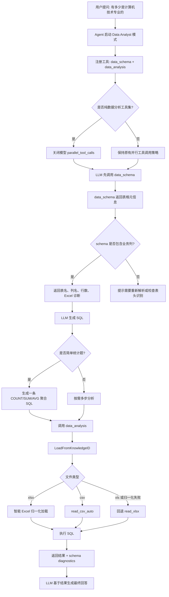
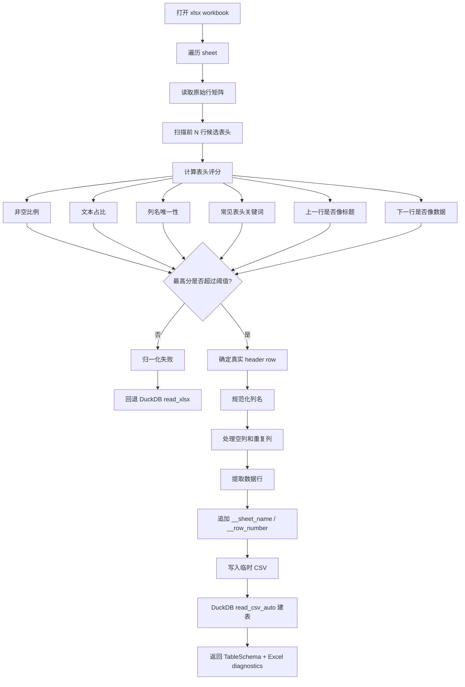
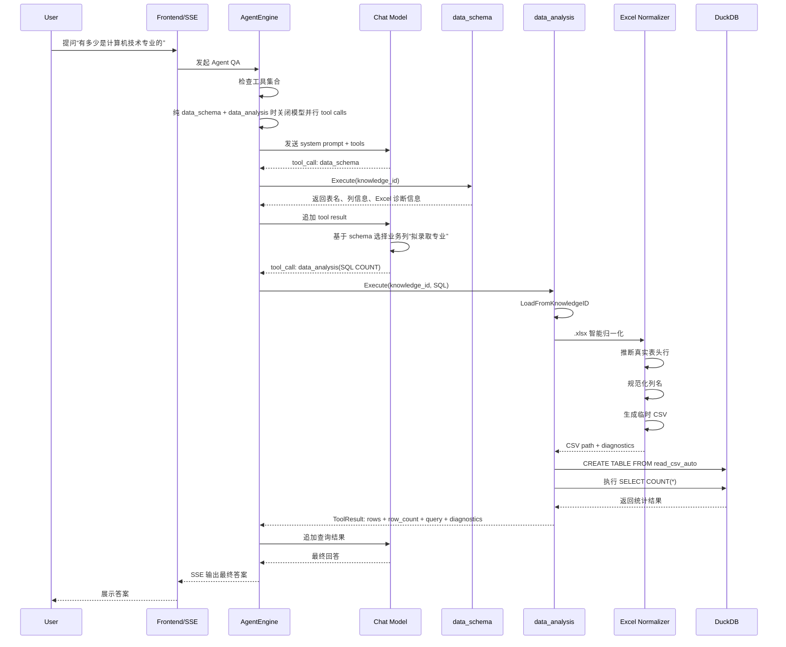

# Data Analysis Excel 智能解析流程

本文档记录数据分析智能体处理 Excel 表格问答时的业务实现逻辑，重点说明 `.xlsx` 智能表头识别、DuckDB 建表、Agent 工具调用收敛，以及本轮修复中涉及的边界。

## 背景

用户询问“有多少是计算机技术专业的”时，原始 Excel 的实际结构是：

- 第 1 行：整份表的大标题。
- 第 2 行：真实表头，包含 `拟录取专业`。
- 第 3 行开始：真实数据行。
- workbook 包含多个 sheet。

旧逻辑直接使用 DuckDB `read_xlsx(..., header=true)`，会把第 1 行大标题当成列名，导致 schema 中看不到 `拟录取专业`。模型只能从 `考生编号` 里用 `SUBSTRING` 猜专业代码，最终 SQL 业务逻辑错误。

优化后的目标是：`.xlsx` 优先在 Go 侧用 `excelize` 做智能结构识别，再把规范化表格交给 DuckDB 查询；同时让简单统计问题尽量收敛为一次明确的聚合 SQL。

## 核心业务逻辑

1. 用户在数据分析智能体中提问。
2. Agent 注册 `data_schema` 和 `data_analysis` 工具。
3. 运行时判断当前工具集合：
   - 纯 `data_schema` + `data_analysis` 时，关闭模型侧并行 tool calls。
   - 其它 Agent 或混合工具场景保持原有并行 tool calls 行为。
4. LLM 先调用 `data_schema` 获取表名、列名、行数和 Excel 诊断信息。
5. LLM 根据 schema 生成 SQL。
   - 简单计数、求和、平均值等问题优先生成一条聚合 SQL。
   - 优先使用 schema 中的业务列，例如 `拟录取专业`。
   - 不应从 ID 或编号中截取片段来猜业务含义，除非 schema 明确说明编码规则。
6. `data_analysis` 加载知识文件：
   - `.xlsx` 优先走智能归一化。
   - `.xls` 或归一化失败时回退旧 DuckDB `read_xlsx` 路径。
   - `.csv` 继续走 `read_csv_auto`。
7. DuckDB 执行 SQL，工具返回结果、SQL、行数和 schema 诊断。
8. LLM 基于工具结果生成最终回答。

## Excel 智能归一化

`.xlsx` 的智能加载流程不针对某个文件名或业务字段硬编码，而是通过通用评分机制识别真实表头。

### 表头评分维度

- 非空单元格比例。
- 文本占比。
- 列名唯一性。
- 常见表头关键词，例如 `编号`、`姓名`、`专业`、`代码`、`成绩`、`日期`、`状态`、`id`、`name`、`code`、`major` 等。
- 上一行是否更像标题行。
- 下一批行是否更像数据行。

### 归一化结果

归一化后会生成统一 CSV，再由 DuckDB 加载：

- 自动跳过大标题、说明行、空行。
- 使用推断出的真实表头作为列名。
- 空列名会变成 `column_1`、`column_2` 等。
- 重复列名会追加后缀，例如 `拟录取专业__2`。
- 每行追加：
  - `__sheet_name`：来源 sheet。
  - `__row_number`：原始 Excel 行号。
- 多 sheet 按列名合并，缺失列保持空值。

识别失败时不会强行猜测，会回退旧路径，并在 schema diagnostics 中提示表头推断未生效。

## 流程图

## Excel 归一化流程图

## 时序图

## 影响边界

- `agent_type_presets.yaml` 不新增 `parallel_tool_calls: false`，避免把关闭并行工具调用变成持久配置行为。
- 并行 tool call 的收敛是运行时判断，只作用于纯 `data_schema` + `data_analysis` 工具集。
- 普通 RAG、混合工具、网页搜索、MCP 等 Agent 场景保持原有并行工具调用行为。
- `.xlsx` 智能归一化优先；`.xls` 或识别失败仍可回退旧 DuckDB 路径。
- 已入库的历史 Excel 需要重新解析或重建 data table summary，新 schema 才会进入知识库。

## 验证重点

- 第 1 行大标题、第 2 行真实表头的 Excel 能正确识别 `拟录取专业`。
- `SELECT COUNT(*) WHERE "拟录取专业" = '计算机技术'` 返回正确数量。
- 多 sheet 可按 `__sheet_name` 过滤。
- 重复列名和空列名能稳定规范化。
- 无明显表头的纯数字表格不会强行猜测，能安全回退。
- 纯数据分析工具集不会再一次性发起多条 speculative SQL。
