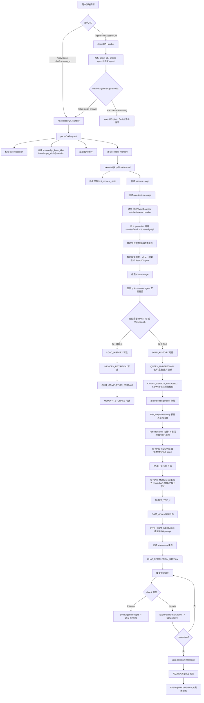
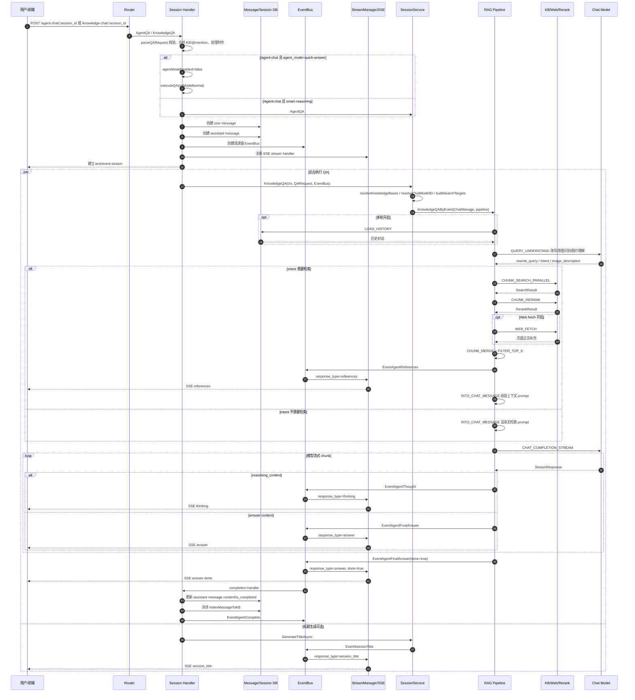

# 快速回答对话业务流程

本文档记录 WeKnora 快速回答（`quick-answer`）对话的后端业务实现逻辑，重点说明请求入口、模式路由、RAG pipeline、流式事件和持久化收口。

## 核心结论

`builtin-quick-answer` 是基于知识库的 RAG 问答模式，不进入 ReAct Agent 工具循环。即使请求发送到 `/api/v1/agent-chat/:session_id`，只要解析到的智能体配置为 `agent_mode=quick-answer`，后端也会路由到普通 KnowledgeQA/RAG pipeline。

只有 `agent_mode=smart-reasoning` 的智能体才会进入 Agent Engine，并执行多轮思考、工具调用、审批等 ReAct 流程。

## 关键代码位置

- 路由注册：`internal/router/router.go`
  - `/knowledge-chat/:session_id` -> `handler.KnowledgeQA`
  - `/agent-chat/:session_id` -> `handler.AgentQA`
- 请求解析与模式判断：`internal/handler/session/qa.go`
  - `parseQARequest`
  - `AgentQA`
  - `executeQA`
  - `setupSSEStream`
- RAG 服务入口：`internal/application/service/session_knowledge_qa.go`
  - `KnowledgeQA`
  - `KnowledgeQAByEvent`
- Pipeline 插件：
  - `chat_pipeline/query_understand.go`
  - `chat_pipeline/search_parallel.go`
  - `chat_pipeline/search.go`
  - `chat_pipeline/rerank.go`
  - `chat_pipeline/merge.go`
  - `chat_pipeline/filter_top_k.go`
  - `chat_pipeline/into_chat_message.go`
  - `chat_pipeline/chat_completion_stream.go`
- 知识库检索底座：
  - `internal/application/service/knowledgebase_search.go`
  - `internal/types/search.go`
  - `internal/types/retriever.go`
  - `internal/application/service/retriever/composite.go`
- Agent 工具检索路径：
  - `internal/application/service/session_agent_qa.go`
  - `internal/application/service/agent_service.go`
  - `internal/agent/tools/knowledge_search.go`
- 流式事件写回：`internal/handler/session/agent_stream_handler.go`
- 内置快速回答配置：`config/builtin_agents.yaml`

## 入口与模式路由

快速回答可以从两个入口进入：

1. `/knowledge-chat/:session_id`

   - 直接进入 `KnowledgeQA`。
   - 固定走 `qaModeNormal`。
2. `/agent-chat/:session_id`

   - 先进入 `AgentQA`。
   - Handler 会解析 `agent_id` 对应的自定义或内置智能体。
   - 如果 `customAgent.IsAgentMode()` 为 `false`，说明不是 ReAct Agent，转入 `qaModeNormal`。
   - `builtin-quick-answer` 的 `agent_mode=quick-answer`，因此会走 `qaModeNormal`。
   - 如果 `customAgent.IsAgentMode()` 为 `true`，才进入 `qaModeAgent`。

## 请求预处理

`parseQARequest` 负责把 HTTP 请求转换成统一的 `qaRequestContext`：

1. 校验 `session_id` 和 `query`。
2. 读取会话信息。
3. 根据 `agent_id` 解析自有 agent 或共享 agent。
4. 合并请求中的 `knowledge_base_ids`、`knowledge_ids` 和 `@mention` 项。
5. 清理客户端传入的图片 URL，避免 SSRF。
6. 保存 base64 图片到对象存储。
7. 处理文件附件，必要时做音频 ASR。
8. 解析 `enable_memory`，优先使用请求显式值，否则读取用户偏好。
9. 生成 `qaRequestContext`，供后续消息创建、SSE 和 service 调用使用。

## RAG Pipeline 组装

`sessionService.KnowledgeQA` 会解析知识库范围、聊天模型、VLM 模型、检索租户和搜索目标，并构造 `types.ChatManage`。

随后根据是否需要检索组装不同 pipeline。

### 纯聊天路径

当没有知识库、没有指定文件，且没有启用 Web Search 时：

```text
LOAD_HISTORY? -> MEMORY_RETRIEVAL? -> CHAT_COMPLETION_STREAM -> MEMORY_STORAGE?
```

### RAG 路径

当存在知识库、指定文件，或启用 Web Search 时：

```text
LOAD_HISTORY?
-> QUERY_UNDERSTAND
-> CHUNK_SEARCH_PARALLEL
-> CHUNK_RERANK
-> WEB_FETCH?
-> CHUNK_MERGE
-> FILTER_TOP_K
-> DATA_ANALYSIS?
-> INTO_CHAT_MESSAGE
-> CHAT_COMPLETION_STREAM
```

各阶段职责：

- `LOAD_HISTORY`：加载多轮历史，受 agent 的 `multi_turn_enabled` 和 `history_turns` 控制。
- `QUERY_UNDERSTAND`：进行问题改写、意图识别、图片理解。
- `CHUNK_SEARCH_PARALLEL`：并行执行知识库 chunk 检索、实体检索和 Web Search。
- `CHUNK_RERANK`：使用 rerank 模型重排，应用阈值降级、FAQ boost、MMR 去冗余。
- `WEB_FETCH`：Web Search 后可选抓取网页正文。
- `CHUNK_MERGE`：合并 chunk、父子 chunk 回填、FAQ 答案填充、短上下文扩展和去重。
- `FILTER_TOP_K`：按 `rerank_top_k` 截断最终上下文。
- `DATA_ANALYSIS`：可选的数据分析阶段，默认不启用。
- `INTO_CHAT_MESSAGE`：把检索结果和用户问题渲染成最终 prompt。
- `CHAT_COMPLETION_STREAM`：调用聊天模型并把模型输出转换成流式事件。

## 知识库检索流程

快速回答的知识库检索不是由模型主动调用工具触发，而是在 `KnowledgeQA` 的 RAG pipeline 中固定执行。核心数据结构是 `types.ChatManage` 和 `types.SearchTargets`。

### 检索范围解析

`sessionService.KnowledgeQA` 会先调用 `resolveKnowledgeBases` 解析本轮有效范围，优先级如下：

1. 请求显式传入的 `knowledge_base_ids`、`knowledge_ids`，以及输入框 `@mention` 合并后的结果。
2. 如果智能体配置了 `retrieve_kb_only_when_mentioned=true`，且本轮没有显式提及知识库或文件，则禁用知识库检索。
3. 否则使用智能体配置的知识库范围，可能是指定知识库，也可能是 `KBSelectionMode=all` 下解析出的全部可用知识库。

随后 `buildSearchTargets` 会把范围统一成两类目标：

- `SearchTargetTypeKnowledgeBase`：搜索整个知识库。
- `SearchTargetTypeKnowledge`：只搜索指定文档，并按文档所属知识库分组。

这个阶段还会处理共享知识库场景：同租户知识库直接使用当前租户；跨租户共享知识库需要检查访问权限，通过后使用知识库所属租户作为检索租户。

### Chunk 检索阶段

`CHUNK_SEARCH_PARALLEL` 会并行执行普通 chunk 检索和实体检索。普通 chunk 检索由 `chat_pipeline/search.go` 负责，关键流程是：

1. 使用 `RewriteQuery` 作为实际检索 query。`RewriteQuery` 来自 `QUERY_UNDERSTAND`，默认等于用户原始问题。
2. 批量加载 SearchTargets 对应的知识库，解析每个知识库的 embedding model identity。
3. 按 embedding model 分组，避免多个知识库使用同一模型时重复计算 query embedding。
4. 每个分组内先调用 `GetQueryEmbedding` 计算一次 query embedding。
5. 对整库目标，把同一分组内的多个 KB 合并成一次 `HybridSearch`，通过 `SearchParams.KnowledgeBaseIDs` 传入。
6. 对指定文档目标，优先尝试直接加载 chunks；如果文档过大或加载失败，再按 `KnowledgeIDs` 调用 `HybridSearch`。
7. 如果开启 Web Search，还会并发执行 Web 检索，并把结果合并进 `SearchResult`。
8. 如果召回不足且启用了 query expansion，会追加一轮偏关键词的扩展检索。

指定文档的直接加载有一个保护阈值：最多直接加载约 50 个 chunk，避免把大文档一次性塞进上下文；超过限制的文档仍走检索路径。

### HybridSearch 内部

`knowledgeBaseService.HybridSearch` 是普通 RAG 和 Agent `knowledge_search` 共用的底层检索入口。它的主要步骤是：

1. 确定实际检索 KB 集合：优先使用 `SearchParams.KnowledgeBaseIDs`，否则使用传入的单个 KB ID。
2. 批量加载知识库记录，并对每个 KB 做权限校验；跨租户 KB 必须通过共享权限检查。
3. 校验多 KB 检索的 embedding model 是否一致，避免不同向量空间的结果混排。
4. 必要时计算 query embedding；如果上游已经预计算，则直接复用 `SearchParams.QueryEmbedding`。
5. 按向量库 store 和 owner tenant 分组，解析每组对应的 retriever engine。
6. 构造 `RetrieveParams`，按关键词检索和向量检索并发 fan-out 到具体引擎，例如 PostgreSQL、SQLite、Qdrant、Milvus、Weaviate 等。
7. 对不同引擎返回的分数做归一化，然后区分 vector results 和 keyword results。
8. 使用 RRF 或去重策略融合关键词和向量结果。
9. 对 FAQ 知识库做额外后处理，例如 FAQ 优先、相似问处理和 topK 扩展。
10. 截断到 `MatchCount`，再把检索索引结果转换成 `SearchResult`。

返回的 `SearchResult` 包含 chunk 内容、知识库 ID、文档 ID、文档标题、chunk 序号、分数、匹配类型、FAQ metadata、图片信息等字段，后续 rerank 和 prompt 组装都围绕这个结构进行。

### 重排、合并和 Prompt 注入

检索结果不会直接进入模型。后续会经过三层加工：

1. `CHUNK_RERANK`：使用 rerank model 对候选 passage 重排；如果 rerank 失败，会回退到原始检索结果。重排后会叠加原始检索分、FAQ boost，并用 MMR 降低重复内容。
2. `CHUNK_MERGE`：优先使用 `RerankResult`，为空时回退到 `SearchResult`；然后去重、注入相关历史引用、解析父 chunk、合并相邻/重叠 chunk、填充 FAQ 答案、扩展短上下文。
3. `INTO_CHAT_MESSAGE`：把最终 `MergeResult` 渲染成 `<context>` 片段，并替换 `context_template` 中的 `query`、`contexts`、`language` 占位符，得到最终发给聊天模型的 user prompt。

因此，快速回答中的“检索知识库信息”完整链路可以概括为：

```text
请求 KB/文档/@mention
-> resolveKnowledgeBases
-> buildSearchTargets
-> QUERY_UNDERSTAND 生成 RewriteQuery/Intent
-> CHUNK_SEARCH_PARALLEL
-> HybridSearch 关键词+向量混合检索
-> CHUNK_RERANK
-> CHUNK_MERGE
-> INTO_CHAT_MESSAGE 注入 prompt
-> CHAT_COMPLETION_STREAM 生成答案
```

## 与 Agent 工具检索的区别

`smart-reasoning` Agent 模式也能检索知识库，但触发方式不同：

- 快速回答：后端固定执行 RAG pipeline，只要本轮需要 RAG，就会自动检索。
- Agent 模式：后端创建 Agent Engine，并把 `knowledge_search`、`grep_chunks`、`list_knowledge_chunks`、`query_knowledge_graph` 等工具注册给模型；是否检索、检索几次、用什么查询词，由模型在 ReAct 循环中决定。

Agent 模式入口在 `sessionService.AgentQA`。它会：

1. 解析 agent 所属租户和知识库范围。
2. 构造 `AgentConfig`，加载聊天模型和必要的 rerank model。
3. 创建 Agent Engine。
4. 在 `agent_service.CreateAgentEngine` 中按知识库能力过滤工具：没有知识库时移除知识库工具；没有 RAG 能力的 KB 会移除 RAG 工具；没有 Wiki 能力的 KB 会移除 Wiki 工具。
5. 注册 `knowledge_search` 时传入同一份 `SearchTargets`。

当模型调用 `knowledge_search` 时，`internal/agent/tools/knowledge_search.go` 会：

1. 解析模型传入的 `queries`，要求 1 到 5 个语义查询。
2. 基于预计算的 `SearchTargets` 限定检索范围，模型只能在 agent 被授权的 KB/文档内检索。
3. 过滤 wiki-only 或 graph-only 等不可做普通 RAG 检索的 KB。
4. 按 embedding model 分组并预计算 query embedding。
5. 调用同一个 `knowledgeBaseService.HybridSearch` 做底层混合检索。
6. 对结果去重、rerank、MMR，再格式化成工具结果返回给 Agent。

所以两条路径的底层检索能力基本共用，差异在编排层：

- 普通快速回答是 pipeline 编排，适合“一问一答 + 自动 RAG”。
- Agent 是工具编排，适合需要多步查找、对比、追问、组合多个工具的任务。

## 流式事件

快速回答复用 Agent 事件体系，但事件来源是 RAG pipeline，不是 Agent Engine。

`CHAT_COMPLETION_STREAM` 会调用聊天模型的 `ChatStream`：

- 模型输出 `ResponseTypeThinking` 时，转为 `EventAgentThought`。
- 模型输出 `ResponseTypeAnswer` 时，转为 `EventAgentFinalAnswer`。
- 模型输出错误时，转为 `EventError`。

Handler 层的 `AgentStreamHandler` 再把 EventBus 事件写入 `StreamManager`，并通过 SSE 返回给前端：

- `EventAgentThought` -> `response_type=thinking`
- `EventAgentReferences` -> `response_type=references`
- `EventAgentFinalAnswer` -> `response_type=answer`
- `EventSessionTitle` -> `response_type=session_title`
- `EventError` -> `response_type=error`

检索引用 `references` 会在 `CHAT_COMPLETION_STREAM` 之前发送，保证前端在答案流开始前或开始时就能拿到引用信息。

## 完成与持久化

快速回答完成条件是收到 `EventAgentFinalAnswer` 且 `Done=true`。

完成后 Handler 会：

1. 累加 answer chunk 到 assistant message。
2. 标记 `assistantMessage.IsCompleted=true`。
3. 更新消息记录。
4. 异步把问答对索引进聊天历史知识库。
5. 发出 `EventAgentComplete`，用于结束本轮事件流。

如果启用了会话标题生成，`setupSSEStream` 会异步调用 `GenerateTitleAsync`，并通过 `session_title` 事件返回标题。

## 异常与兜底

RAG pipeline 中如果检索阶段返回 `ErrSearchNothing`，`KnowledgeQAByEvent` 会调用 fallback：

- `fallback_strategy=fixed`：直接返回固定兜底文案。
- `fallback_strategy=model`：使用 fallback prompt 再调用模型生成兜底回答。

如果用户主动停止生成，异步上下文会被取消。Handler 会把这种取消视为预期结果，不额外发送错误事件，也不会把兜底答案覆盖到已停止的空回答里。

## 流程图



## 时序图


